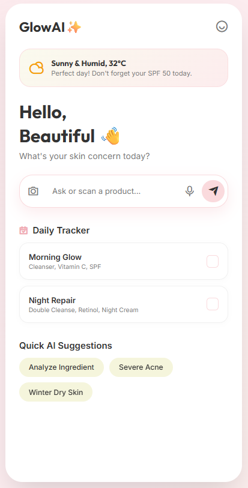
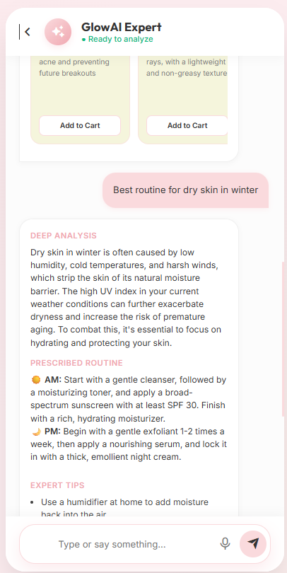

<div align="center">


<p><b>Advanced AI-Powered Skincare Assistant — Mobile · Web · API</b></p>

<p>
  
  
  
  
  
  
</p>

</div>

---

## 📱 App Screenshots

<div align="center">
<table>
  <tr>
    <td align="center">
      
      <br/>
      <sub><b>🏠 Home Screen</b></sub>
      <br/>
      <sub>Daily Tracker · Weather Skin Tips · Quick AI Suggestions</sub>
    </td>
    <td align="center" width="60">&nbsp;</td>
    <td align="center">
      
      <br/>
      <sub><b>🤖 AI Chat Screen</b></sub>
      <br/>
      <sub>Deep Analysis · Prescribed Routine · Expert Tips</sub>
    </td>
  </tr>
</table>
</div>

---

## 🌟 Key Features

| Feature | Description |
|---|---|
| 🤖 **AI Skin Analysis** | Powered by **Groq** running `llama-3.3-70b-versatile` for ultra-fast dermatology responses |
| 🎙️ **Voice Input** | Speak your skin concerns — the AI listens and responds |
| 📸 **Ingredient Scanner** | Scan product ingredients to detect harmful or beneficial compounds |
| 🌦️ **Weather-Aware Tips** | Real-time weather context adjusts your daily skincare advice (UV index, humidity, etc.) |
| 📅 **Daily Routine Tracker** | Track Morning Glow & Night Repair routines with interactive checkboxes |
| 💊 **Doctor Alert System** | Automatically flags severe conditions (bleeding acne, extreme allergies) with booking prompt |
| 🛍️ **Smart Product Recs** | AI recommends top 3 real products with direct Amazon purchase links |
| ℹ️ **About & Version System** | In-app About dialog showing current version and changelog — updates with every release |

---

## 🛠️ Tech Stack (Real Data)

### 📱 Frontend — Flutter Mobile App
| Package | Version | Purpose |
|---|---|---|
| `flutter` SDK | `>=3.0.0 <4.0.0` | Core mobile framework |
| `google_fonts` | `^6.1.0` | Premium typography (UI polish) |
| `http` | `^1.1.0` | Backend API communication |
| `url_launcher` | `^6.2.1` | Open product buy links in browser |
| `cupertino_icons` | `^1.0.2` | iOS-style icon support |

### ⚙️ Backend — Node.js Express API
| Package | Version | Purpose |
|---|---|---|
| `express` | `^4.18.2` | REST API server framework |
| `mongoose` | `^7.5.0` | MongoDB ODM for data modeling |
| `openai` | `^4.10.0` | SDK used to interface with Groq API |
| `cors` | `^2.8.5` | Cross-origin resource sharing |
| `dotenv` | `^16.3.1` | Environment variable management |

### 🤖 AI Engine
| Property | Value |
|---|---|
| **Provider** | [Groq Cloud](https://console.groq.com) |
| **Model** | `llama-3.3-70b-versatile` |
| **API Base URL** | `https://api.groq.com/openai/v1` |
| **Protocol** | OpenAI-compatible SDK (drop-in) |
| **Temp / Tokens** | `0.7` / `1000 max_tokens` |

### 🗄️ Database
| Property | Value |
|---|---|
| **Engine** | MongoDB (local or Atlas) |
| **Default URI** | `mongodb://localhost:27017/glowina_ai` |
| **ODM** | Mongoose v7.5.0 |

---

## 📂 Project Structure

```
Glowina-AI/
├── 📁 backend/              # Node.js Express API Server
│   ├── server.js            # Main server entry — AI chat endpoint & MongoDB
│   ├── .env                 # GROQ_API_KEY & MONGODB_URI (not committed)
│   ├── package.json         # Backend dependencies
│   └── models/              # Mongoose data models
│
├── 📁 frontend/             # Flutter Mobile App
│   ├── lib/
│   │   ├── main.dart        # App entry point
│   │   ├── screens/
│   │   │   ├── login_screen.dart   # Welcome / Login
│   │   │   ├── home_screen.dart    # Main dashboard with About dialog
│   │   │   └── chat_screen.dart    # AI chat with analysis & recommendations
│   │   └── theme/
│   │       └── app_theme.dart      # Global theme tokens
│   └── pubspec.yaml         # Flutter dependencies
│
├── 📁 web-preview/          # Interactive browser demo
│   └── index.html           # Standalone HTML/JS/CSS demo (no build needed)
│
└── 📁 photo/                # App screenshots
    ├── System.png
    └── chatbot.png
```

---

## 🚀 Quick Start Guide

### Step 1 — Clone the Repository
```bash
git clone https://github.com/engrshuvodas/Glowina-AI.git
cd Glowina-AI
```

### Step 2 — Backend Setup
```bash
cd backend
npm install
```

Create your `.env` file:
```env
GROQ_API_KEY=your_groq_api_key_here
MONGODB_URI=mongodb://localhost:27017/glowina_ai
PORT=5000
```

> 💡 Get your free Groq API key at [console.groq.com](https://console.groq.com)

Start the server:
```bash
npm start
# ✅ Glowina AI Backend running on http://localhost:5000
```

### Step 3 — Flutter App Setup
```bash
cd ../frontend
flutter pub get
flutter run
```

> 📝 In `api_service.dart`, `baseUrl` is set to `http://10.0.2.2:5000` for Android Emulator. For iOS Simulator or Web, change to `http://localhost:5000`.

### Step 4 — Web Preview (No Setup Needed!)
Simply open `web-preview/index.html` in your browser, or serve it:
```bash
python -m http.server 8080
# Open http://localhost:8080
```

---

## 📋 Changelog

### v2.2 — April 2026
- ✅ Official rename from **GlowAI** → **Glowina AI** across all files
- ✅ Added **central About System** with in-app version display and changelog
- ✅ About info icon added to both Flutter & Web app home screens
- ✅ Backend AI prompt updated to new brand identity

### v2.1 *(prior)*
- ✅ AI Model upgraded to **Llama-3.3-70b-versatile** via **Groq Cloud**
- ✅ Replaced OpenAI GPT-3.5 backend with Groq API (faster, free tier)
- ✅ Ingredient scanner simulation added to web preview
- ✅ Voice input (Web Speech API) integrated for hands-free use

### v1.0
- 🚀 Initial release with AI skincare chat, product recommendations, and doctor alert system

---

## 🤝 Contributing

Contributions, issues and feature requests are welcome! Feel free to open an issue or submit a pull request.

---

<div align="center">
  <p>Made with ❤️ and ✨ for beautiful skin everywhere.</p>
  <p><b>Glowina AI</b> — <i>Because your skin deserves the best.</i></p>
</div>
